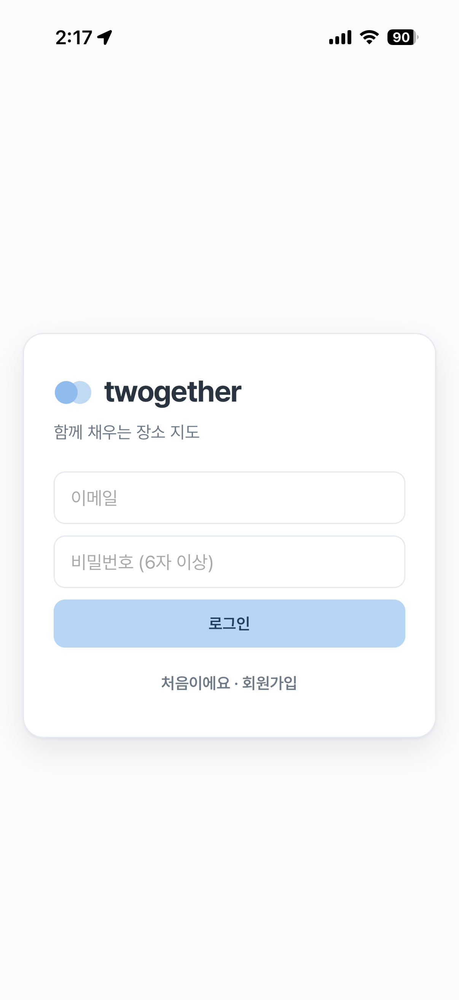
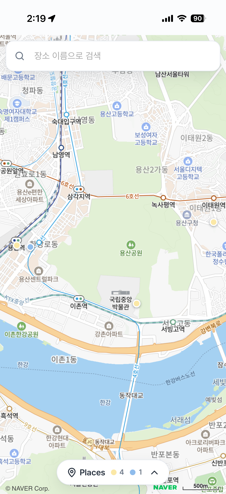
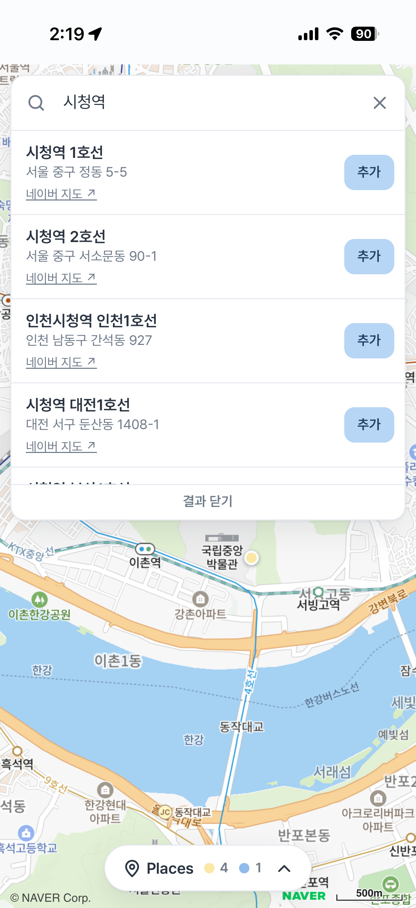
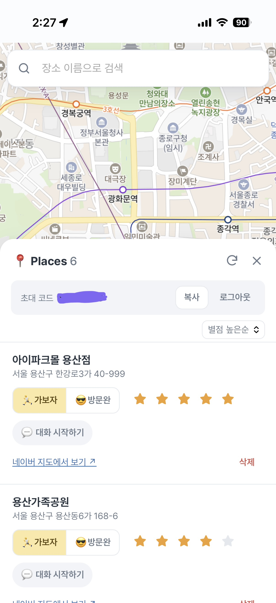
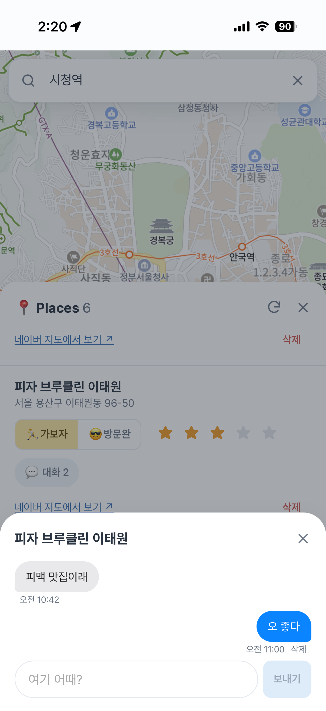

# twogether

함께 가고 싶은 장소를 모아 실시간으로 같이 채워 가는 지도 서비스입니다. 초대 코드로 같은 방에 들어온 사람끼리 장소를 추가하고, 가 본 곳인지 표시하고, 별점과 대화를 남깁니다. 한 사람이 바꾸면 다른 사람의 화면에도 바로 반영됩니다.

**배포 주소:** https://twogether-three.vercel.app (회원가입 후 방을 만들거나 초대 코드로 입장)

<p>
  
  
  
</p>
<p>
  
  
</p>

로그인, 지도와 마커, 장소 검색, 저장한 장소 목록(별점순), 장소별 대화 순서입니다. 아이폰 홈 화면 앱에서 캡처했습니다.

## 만든 이유

네이버 지도에 저장한 장소 목록을 친구나 가족과 공유하면 공유하는 시점의 목록만 보이고, 그 뒤에 추가한 장소는 갱신되지 않아 같이 채워 갈 수 없었습니다. 그래서 네이버 지도는 화면과 길 찾기용으로만 쓰고, 목록은 직접 만든 DB에서 함께 편집하는 구조로 만들었습니다. 만든 사람이 실제로 쓰고 있고, 사용하면서 나온 불편을 고쳐 온 기록이 [docs/DEVLOG.md](docs/DEVLOG.md)에 있습니다.

## 주요 기능

- 카카오 로컬 API 키워드 검색으로 장소를 찾아 저장 (검색 결과에서 바로 네이버 지도로 확인 가능)
- 지도 마커와 저장 목록 연동: 마커를 누르면 해당 장소가 강조되고, 목록에서 고르면 지도가 이동
- 가보자 / 방문완 상태(마커 색 구분), 별점, 삭제, 별점순 정렬
- 장소별 대화: 메시지 앱처럼 말풍선으로 주고받고, 내 글만 삭제
- 마커 아래에 장소 이름 표시(확대했을 때만)
- AI 코스 짜기: 방에 저장한 "가보자" 장소들을 이동 거리와 하루 흐름을 고려해 순서대로 짜 줌(Gemini API). 결과는 가운데 선이 있는 타임라인으로 보이고 장소 사이에 예상 도보 시간이 표시됨. 마음에 드는 코스는 방에 저장해 두고 멤버 모두가 다시 볼 수 있음
- 이름을 붙인 방을 여러 개 만들고 들어갈 수 있음(연인용, 친구용 등). 초대 코드로 입장(방당 최대 4명), 방 단위 데이터 격리, 방 나가기
- 실시간 동기화: 다른 사람의 추가, 수정, 삭제가 새로고침 없이 반영
- 모바일 우선 화면(위쪽 검색창, 아래에서 올라오는 저장 목록 시트, 스와이프로 닫기)와 PWA 설치

## 기술 스택

| 영역 | 사용 기술 |
|---|---|
| 프론트엔드 | React, TypeScript, Vite |
| 지도 | 네이버 Dynamic Map (Maps JS v3) |
| 장소 검색 | 카카오 로컬 API (키워드 검색) |
| 백엔드 | Supabase: Postgres, Auth, Realtime, Row Level Security, SQL 함수 |
| 서버리스 | Vercel Functions (검색 API 프록시, AI 코스 추천) |
| AI | Google Gemini API (3.5 Flash-Lite, 무료 한도) |
| 배포 | GitHub → Vercel 자동 배포 |

## 구조

```
브라우저 ──> 네이버 지도 (공개 가능한 Client ID)
   │
   ├──> /api/search ──(Vercel 함수: 서버에서 REST 키 추가)──> 카카오 로컬 API
   │
   ├──> /api/course ──(Vercel 함수: 로그인 토큰으로 장소 조회 후 AI 호출)──> Gemini API
   │
   └──> Supabase ── Auth(로그인) · Postgres(RLS로 방 단위 접근 제한) · Realtime(변경 구독)
```

테이블은 `rooms`, `room_members`, `places`, `place_comments`, `room_courses` 다섯 개입니다. 전체 정의는 [supabase/schema.sql](supabase/schema.sql)에 있습니다.

## 설계 결정과 문제 해결

### 1. 검색 API가 사라져서 카카오로 교체, 키는 서버에만

처음에는 네이버 지역 검색을 쓰려 했지만 네이버 개발자센터에서 검색 API 신청 항목이 없었습니다. 검색 API가 NAVER API HUB로 이전되어 신규 신청을 받지 않는 상태였습니다. 지도는 그대로 네이버를 쓰고 검색만 카카오 로컬 API로 바꿨습니다. 한 번에 최대 15개를 돌려주고, 응답의 좌표(경도, 위도)를 네이버 지도에 바로 쓸 수 있었습니다.

카카오 REST 키는 브라우저에 노출되면 안 되므로 `VITE_` 접두사를 붙이지 않은 서버 전용 환경 변수로 두고, [api/search.ts](api/search.ts) 함수가 대신 호출합니다. 이 함수는 검색어만 받아 키워드 검색 한 경로만 호출하고, 임의의 경로를 넘겨 줄 수 없게 했습니다. 개발 중에는 같은 주소(`/api/search`)를 Vite 프록시가 처리해서 코드가 환경에 따라 달라지지 않습니다.

### 2. 방 단위 권한: RLS와 SQL 함수

데이터는 방 단위로 분리됩니다. `is_member()` 함수(`security definer`)로 방 멤버만 `places`를 읽고 쓰게 했고, 정책 안에서 멤버 테이블을 다시 조회할 때 생기는 재귀를 이 함수로 피했습니다.

`rooms`와 `room_members`에는 쓰기 정책을 두지 않았습니다. 방 만들기와 입장은 `create_room()`, `join_room()` 함수로만 가능하고, 그래서 클라이언트가 남의 방에 직접 멤버로 끼어들 수 없습니다. 정원 4명은 `join_room`에서 방 행을 `for update`로 잠근 뒤 인원을 세서, 여러 명이 동시에 입장해도 정원을 넘지 않게 했습니다.

### 3. 실시간 동기화에서 생긴 문제들

- **중복:** 내가 저장하면 성공 응답과 실시간 이벤트로 같은 행이 두 번 들어옵니다. `kakao_id` 기준으로 합쳐서 한 번만 보이게 했고, 추가 중인 임시 행도 실제 행이 오면 같은 방식으로 교체합니다.
- **낙관적 업데이트:** 추가, 수정, 삭제를 화면에 먼저 반영하고 실패하면 이전 상태로 되돌립니다. 추가 중인 행은 저장이 끝나기 전까지 수정과 삭제를 막아 없는 행을 고치는 일을 막았습니다.
- **삭제 이벤트:** DELETE 이벤트에는 삭제된 행의 id만 오고 방 조건으로 거를 수 없습니다. 그래서 화면에 가진 id만 제거하도록 처리했습니다.
- **아이폰 백그라운드:** 웹에서 추가한 장소가 아이폰 홈 화면 앱에 나타나지 않았습니다. iOS가 백그라운드 앱의 연결을 끊고, 놓친 이벤트는 다시 보내 주지 않는 것으로 추정했습니다(직접 재현하지는 못했습니다). 앱이 다시 보일 때, 실시간 연결이 다시 붙을 때, 네트워크가 돌아올 때 목록을 서버 상태로 다시 불러오도록 해서 해결했습니다. 이때 다른 곳에서 삭제된 장소도 함께 정리됩니다.

### 4. 모바일 화면

주로 폰으로 쓰기 때문에 지도를 전체 화면으로 깔고 검색창과 저장 목록을 그 위에 겹쳤습니다. 아이폰에서 검색창과 버튼이 보이지 않는 문제가 있었는데, 원인을 하나로 확정하지 못해 두 가지를 함께 막았습니다. 전체 컨테이너를 `100svh` 대신 `position: fixed`로 바꿔 뷰포트 단위 차이에 의존하지 않게 했고, 지도 컨테이너에 독립된 쌓임 맥락을 만들어 지도 내부 요소가 패널을 덮지 못하게 했습니다.

PWA는 manifest와 아이콘만 넣고 서비스 워커는 넣지 않았습니다. 실시간 동기화 앱이라 오프라인 기능의 이점이 적고, 이전 버전이 캐시에 남는 문제를 피하기 위해서입니다.

### 5. 검색 속도는 추측하지 않고 측정해서 줄이기

검색 반응이 느리다는 피드백이 있어서 구간별로 시간을 재 봤습니다. 카카오에 직접 요청하면 0.08초인데 제 검색 함수를 거치면 0.5초 안팎이었고, 응답 헤더(`X-Vercel-Id`)에서 함수가 미국 동부에서 실행되고 있다는 것을 확인했습니다. 한국에서 미국을 갔다가 다시 한국의 카카오로 가는 왕복이 원인이었습니다. [vercel.json](vercel.json)으로 함수 리전을 서울로 지정해 응답을 0.1~0.4초로 줄였습니다.

추가로 같은 검색어는 기기 안에서 바로 보여 주고, 서버에서는 10분 동안 CDN 캐시로 응답하게 했습니다(개인 정보가 없는 검색 결과만 캐시하고 오류는 캐시하지 않습니다). 입력 중 자동 검색은 입력이 멈춘 뒤 0.2초 후에 호출하고, 입력이 바뀌면 이전 요청을 취소해서 오래된 응답이 최신 결과를 덮어쓰지 않게 했습니다.

### 6. 메모를 대화로 바꾸기

처음에는 장소마다 메모 한 칸이었는데, 둘이 쓰다 보니 한 줄 메모를 덮어쓰는 것보다 서로 답을 주고받는 쪽이 자연스러웠습니다. `place_comments` 테이블을 추가하고 RLS는 방 멤버만 읽고 쓰게, 삭제는 작성자만 되게 했습니다. 기존 메모는 마이그레이션([003](supabase/migrations/003_place_comments.sql))에서 첫 댓글로 옮기고 컬럼을 지워 데이터를 잃지 않았습니다.

### 7. 수정이 되돌아가는 문제

상태나 별점을 바꾸면 잠깐 바뀌었다가 이전 값으로 돌아가는 문제가 있었습니다. 수정 직후 재조회(`load`)가 아직 반영되지 않은 서버 데이터로 화면을 덮어쓴 것이 원인이었습니다. 수정 횟수를 기록해 재조회 도중 수정이 있었으면 그 결과를 버리도록 했습니다. 또 브라우저에서 PATCH가 막히는 경우를 대비해 POST 기반 DB 함수(`update_place`, [004](supabase/migrations/004_update_place.sql))로 다시 시도합니다. `security invoker`라서 RLS는 그대로 적용됩니다.

### 8. AI 코스 짜기: 키와 데이터 경계

Gemini API 키는 카카오 키와 같은 방식으로 서버 전용 환경 변수(`GEMINI_API_KEY`)에만 둡니다. 무료 한도를 아무나 소진하지 못하도록 [api/course.ts](api/course.ts)는 로그인 없이 부를 수 없게 했습니다. 클라이언트는 방 id와 한 줄 요청만 보내고, 함수가 **사용자의 로그인 토큰으로 직접 장소를 조회**합니다. 그래서 RLS가 그 방의 멤버인지 판단하고, 남의 방 데이터를 보내거나 임의의 장소 목록을 넣을 방법이 없습니다.

AI에게는 장소를 번호로 주고 번호로 답하게 했습니다. 서버는 답에서 없는 번호와 중복 번호를 걸러내서, 모델이 존재하지 않는 장소를 지어내도 화면에는 저장한 장소만 나옵니다. 사용자의 요청 문구는 별도 태그로 감싸 형식을 바꾸는 지시로 쓰이지 않게 했습니다. 장소가 2곳 미만이거나 AI 응답이 깨진 경우는 각각 안내 문구를 보여 줍니다. 사용자별 호출 횟수 제한은 아직 없고, 방 멤버(방당 최대 4명)만 호출할 수 있다는 점으로 무료 한도를 지킵니다.

### 9. 공식 API만 사용

네이버 장소 상세(사진, 영업시간, 리뷰)는 공개 API가 없습니다. 크롤링은 하지 않고, 장소 이름과 좌표로 네이버 지도 검색 주소를 만들어 새 탭으로 여는 링크로 대신했습니다. 검색어에는 이름만 넣고 저장된 좌표를 지도 중심으로 넘겨서 주변 결과가 먼저 나오게 했습니다.

## 로컬에서 실행하기

1. 의존성 설치: `npm install`
2. Supabase 프로젝트를 만들고 SQL Editor에서 [supabase/schema.sql](supabase/schema.sql)을 실행합니다. 이 스크립트는 기존 테이블을 지우고 다시 만듭니다.
3. 프로젝트 루트에 `.env.local`을 만들고 아래 값을 채웁니다.

   | 변수 | 설명 |
   |---|---|
   | `VITE_NAVER_MAP_CLIENT_ID` | 네이버 클라우드 플랫폼 Dynamic Map Client ID (Web 서비스 URL에 `http://localhost:5173` 등록) |
   | `VITE_SUPABASE_URL` | Supabase 프로젝트 URL |
   | `VITE_SUPABASE_ANON_KEY` | Supabase 공개(anon) 키 |
   | `KAKAO_REST_API_KEY` | 카카오 REST API 키 (앱의 카카오맵 사용 설정 ON). 서버에서만 사용하며 `VITE_`를 붙이지 않음 |
   | `GEMINI_API_KEY` | AI 코스 짜기용 Google Gemini API 키(선택, Google AI Studio에서 발급). 서버에서만 사용하며, 없으면 코스 짜기만 "설정되지 않았습니다"라고 안내. 모델을 바꾸려면 `GEMINI_MODEL`(기본 `gemini-3.5-flash-lite`) |

4. 실행: `npm run dev` (개발 서버가 `api/course.ts`를 직접 실행하므로, 코스 짜기를 로컬에서 쓰려면 `.env.local`에 `GEMINI_API_KEY`가 필요합니다)

배포할 때는 위 네 개를 Vercel 환경 변수에 넣고, 배포 주소를 네이버 콘솔의 Web 서비스 URL과 Supabase의 Site URL, Redirect URLs에 추가합니다.

## 한계와 다음 계획

- 테스트와 CI가 아직 없습니다.
- 검색 함수가 로그인 없이 호출되므로 남용을 막으려면 Supabase 토큰 검증을 추가해야 합니다.
- 한 지도에 여러 방의 장소를 합쳐 보는 기능은 없고, 방 개수 제한도 없습니다.
- 카테고리 필터가 없고, 시트를 끌어 올리는 동작은 없습니다(닫기만 스와이프).
- 대화는 수정할 수 없고 삭제만 됩니다.
- AI 코스는 요청할 때마다 새로 만들고, 저장한 코스는 저장 당시의 결과 그대로(장소를 지워도 코스는 남음) 보관합니다. 사용자별 호출 횟수 제한은 없습니다.
- 네이버 지도 링크의 좌표 전달 형식은 공식 문서가 아니라 실제 동작으로 확인한 것이라 네이버가 바꾸면 깨질 수 있습니다.

## 개인정보와 키 관리

API 키는 저장소에 포함되어 있지 않습니다. 브라우저에 노출되어도 되는 값(지도 Client ID, Supabase URL과 공개 키)만 `VITE_` 접두사를 쓰고, 카카오 REST 키는 서버 환경 변수로만 읽습니다. 데이터는 방 멤버에게만 보이도록 RLS로 제한됩니다.
